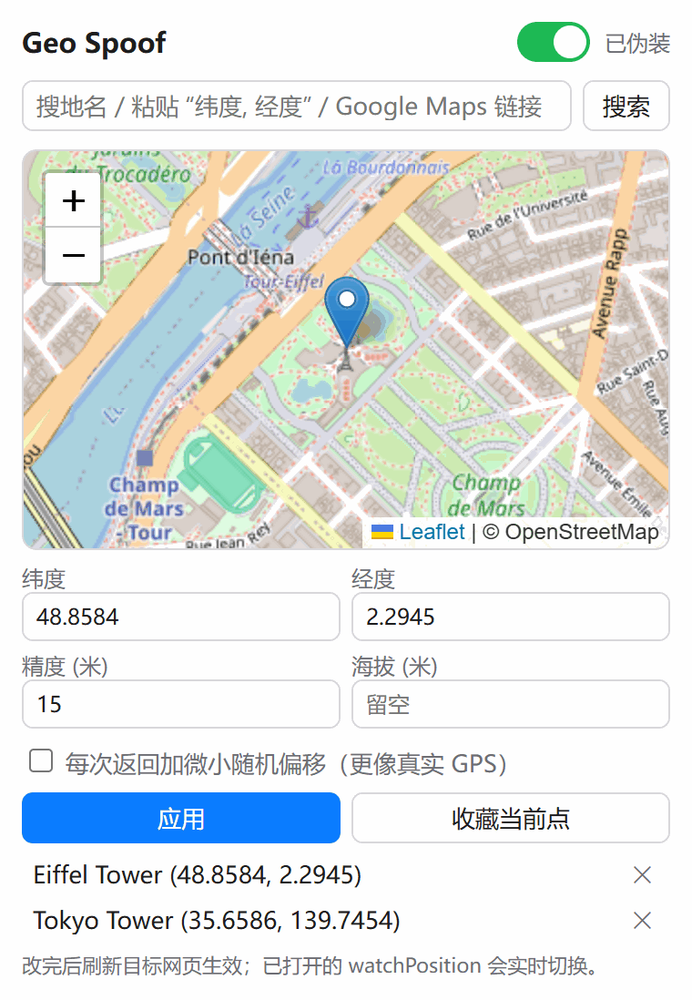
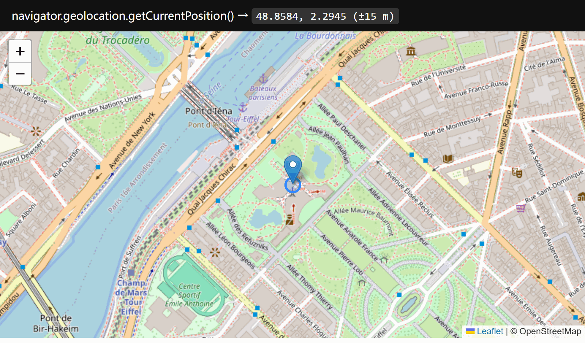

# Geo Spoof

Pick any spot on a map, and websites that ask your browser for your location get that spot instead.


<p>
  
  
</p>

*Left: the popup (its UI is in Chinese). Right: an ordinary page calling `navigator.geolocation.getCurrentPosition()` gets the spoofed point.*

## Features

- **Map picker.** Click the map or drag the pin. The search box accepts place names (OpenStreetMap Nominatim), `lat, lng`, or a Google Maps URL.
- **Realistic fixes.** You can set accuracy (`coords.accuracy`) and altitude. Optional jitter adds a small random offset (within accuracy/3) to each fix.
- **Favorites** for points you use often.
- **Live switching.** Active `watchPosition` callbacks move to the new point immediately.
- **Toolbar badge** reads `ON` while spoofing.
- **Pass-through when off.** When spoofing is off, calls go straight to the real API.

## Install

1. Clone or download this repo.
2. Open `chrome://extensions` and turn on **Developer mode**.
3. Click **Load unpacked** and select the `extension` folder.
4. Pin the extension, open it, pick a point, and turn the switch on. Reload the target page.

After reloading the extension itself, reload any open tabs too. Their injected scripts are orphaned by the reload. They stop spoofing and fall back to the real API; they won't pin the page to a stale position.

## How it works

`inject.js` runs in the page's **main world** at `document_start` in every frame (including `about:blank` and other opaque-origin frames). `bridge.js` runs in the isolated world and passes settings from `chrome.storage` to it.

- `getCurrentPosition`, `watchPosition`, and `clearWatch` return spoofed positions. The objects pass `instanceof GeolocationPosition` checks and serialize with `toJSON`.
- `navigator.permissions.query({name: 'geolocation'})` reports `granted` while spoofing.
- Patched functions still print `[native code]` from `toString()`.

The only permission is `storage`. The content scripts need access to all sites so they can patch geolocation wherever it's called. Nothing is sent anywhere except the place-name searches, which go to Nominatim.

## Limits

- Only the browser Geolocation API is covered. IP-based location (what a site infers from your IP address) needs a VPN or proxy.
- Time zone (`Intl`, `Date`) is not changed, so a site can compare it against the spoofed point.
- Native Windows apps (Weather, Maps) use the Windows location service, which this extension does not touch.

## Development

```
python test/test_extension.py   # end-to-end checks in Playwright Chromium
python docs/screenshots.py      # rebuild the README screenshots
```

The tests load the extension and check spoofed values, live watch switching, jitter bounds, pass-through when disabled, and that the popup loads without errors.
